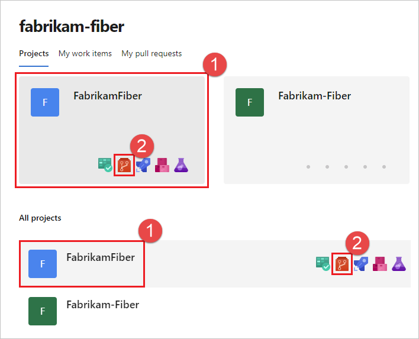
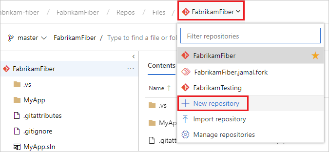

## Create an organization

1.  Go to [Azure
    DevOps](https://go.microsoft.com/fwlink/?LinkId=307137), and use
    either a Microsoft or Azure AD account to sign in. Choose **Next**.

If you were previously signed up for Azure DevOps, select **New
organization**.

2.  Enter the name of your organization and select the location to host
    your projects from the dropdown menu. Choose **Continue**.

Congratulations, you're now an organization owner\! You are prompted to
[create a
project](https://docs.microsoft.com/en-us/azure/devops/organizations/projects/create-project?view=vsts)
to get started. 

**  
**

**Create a repo using the web portal**

Navigate to the **Repos** page in your project by browsing to
https://dev.azure.com/\<your account name, hovering your mouse over the
name of your project, and selecting the **Repos** icon. You can select
it from the **All** projects list, or from the **Recent** projects list
if you have accessed it recently.

 From the repo drop-down, select **New repository**.

 In the **Create a new repository** dialog, verify that Git is the repo
type and enter a name for your new repo. You can also choose to add a
README and create a .gitignore for the type of code you plan to manage
in the repo. A
[README](https://docs.microsoft.com/en-us/azure/devops/repos/git/create-a-readme?view=vsts)
contains information about the code in your repo, and a
[.gitignore](https://docs.microsoft.com/en-us/azure/devops/repos/git/ignore-files?view=vsts)
file tells Git which types of files to ignore, such as temporary build
files from your development environment.

 When you're happy with the repo name and choices, select **Create**.

## Clone the repo to your computer

 From your web browser, open the team project for your organization in
Azure DevOps and select **Repos** \> **Files**.

 Select **Clone** in the upper-right corner of the **Files** window and
copy the clone URL.

 Open Visual Studio Code and press F1 to start the command palette,
type Git: Clone press enter, paste the URL into the repository URL and
press enter, and select the folder were you want to store the cloned
repo.

When completed click on Open repository in lower right corner.

## Work with the code

In VS Code you should now have the repo opened and see the README.md
file, open README.md and make some changes, for example add “This is my
first edit”. to the file and save the changes.

When the file is saved a change will appear in the Source Control tab in
VS Code, you can then click on the changed file in the Source Control
tab and see the changed lines.

To commit the change to write a message to describe the change and click
Commit. The change is then committed to the local repo, to push it to
the remote branch press F1 to start the command palette, type Git Push
and press enter. The commit is now pushed to the remote repo.

To confirm that the commit is pushed to the remote repo in Azure DevOps
browse to
https://dev.azure.com/\<OrganizationName\>/\<ProjectName\>/\_git/\<RepoName\>
and select the History tab to see the commit history.

