LAB Azure AD identity

Scenario

Contoso has 3 administrators:

Jon Donson – Senior IT staff jd@\<tenantname\>

Melon Usk – Security Information mu@\<tenantname\>

Fred Ubar – Junior IT staff fu@\<tenantname\>

Contoso’s Cloud Journey had a rough start

They were all using their normal user accounts to both use resources and
manage the cloud resources.

That worked fine until Jon Donson’s password was leaked by a
3rd party vendor. Someone was able to login, Customer
database was copied, 10 “Gs5 32 Core, 448 GB - $9650/hour” Virtual
Machines were spun up to service Bitcoin mining, adding a substantial
cost to the IT budget.

Management has asked the IT group to implement protection against this
from happening again.

They have asked your help to setup Identity Protection.

Consider:

Administrative Tiers

Create a separate Admin account – that does not share the password  
Privileged Access Workstation? Laptop no 2, Shielded VM, Jumphost?

Multifactor Authentication

Identify the Administrative roles

Enroll Administrators for MFA

Enforce MFA for all Administrative roles

Conditional Access

Protect all users using Conditional Access?

Protect from location? (include or exclude a Named Location)

Protect by Login Risk (Impossible travel, password spray attack etc.)

Administrative Tiers (Bonus reading: https://aka.ms/privsec)

Logon to portal.azure.com – with the Admin credential.

Create 3 new “admin accounts” for the administrators (hint: add an
“underscore” to find it easier.)

Jon Donson – Senior IT staff adminjd@\<tenantname\>

Melon Usk – Security Information adminmu@\<tenantname\>

Fred Ubar – Junior IT staff adminfu@\<tenantname\>

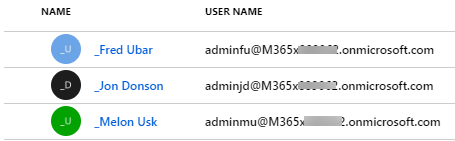

Assign the Global Administrators Directory role to Jon Donson

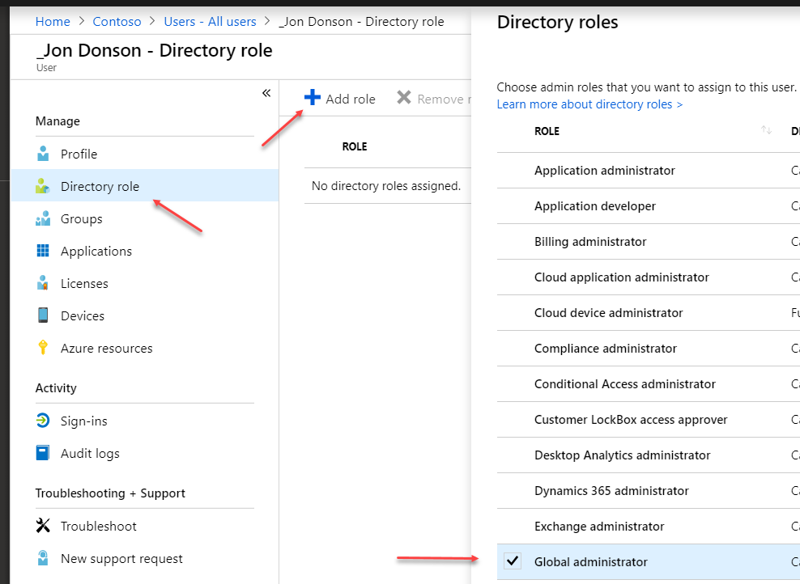

# Multifactor Authentication

Identify the Administrative roles

As a minimum restrict your Global Admins should be MFA enforced. Global
Admins is a role.

Consider what other privileged user groups or roles should have MFA
enforced at your customer site.

## Enrolling Administrators for MFA

Open a browser – with InPrivate setting.

Login with adminjd@\<tenant\> using aka.ms/mfasetup - if you haven’t
changed the password, you will be prompted to do so.

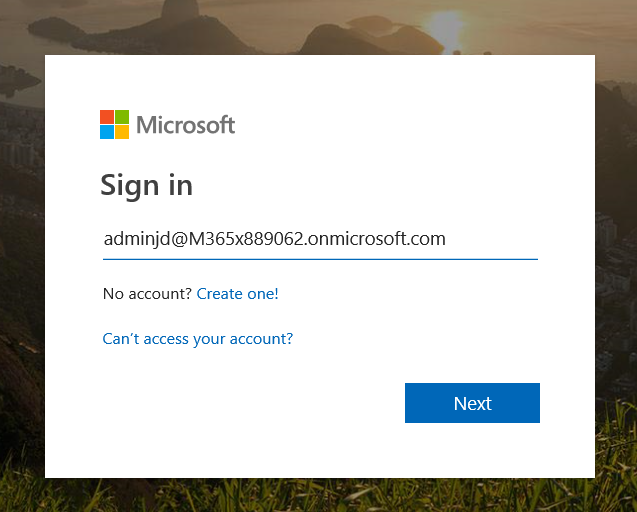 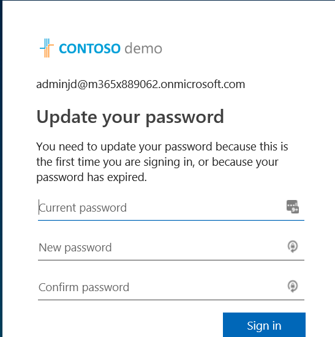

By default new users will be prompted to be enrolled in MFA

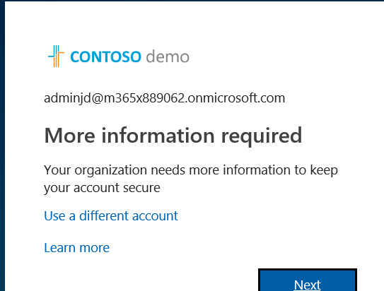

– Existing users need to be pointed at aka.ms/mfasetup to get to the
guide below.

Setup the contact method to be *Authentication phone* and enter your own
*mobilephone number*.

Have your phone ready – and set to silent\! – before pressing next.

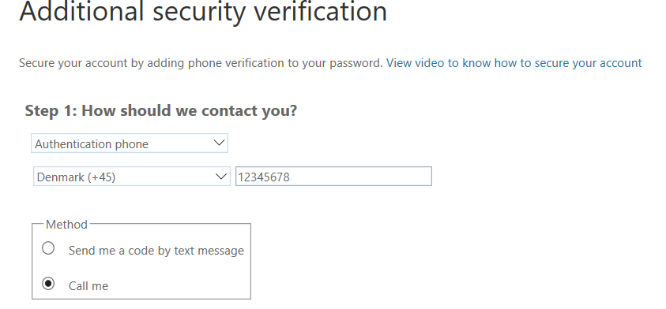

The Microsoft MFA service will call your phone for verification

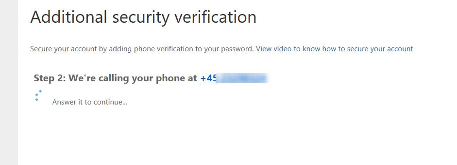

You will be given options to add fur ther MFA options – just close the
browser tab for this demo.

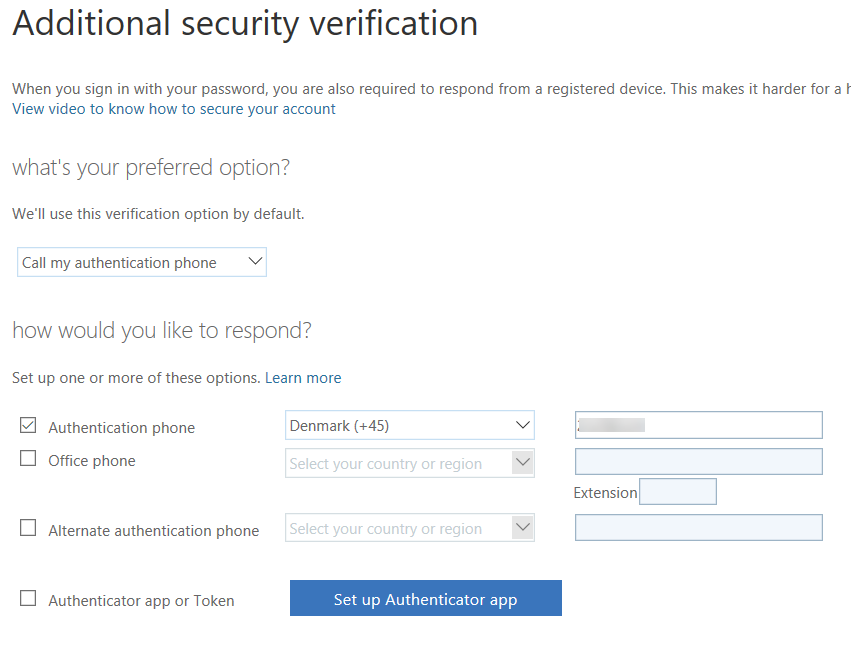

At this stage adminjd is enrolled for MFA authentication.

## Enforce MFA for all Administrative roles

Open portal.azure.com – with the admin@\<tenant\>

Search for Azure Active Directory

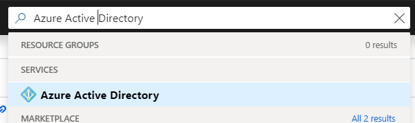

Locate the Security – Conditional Access

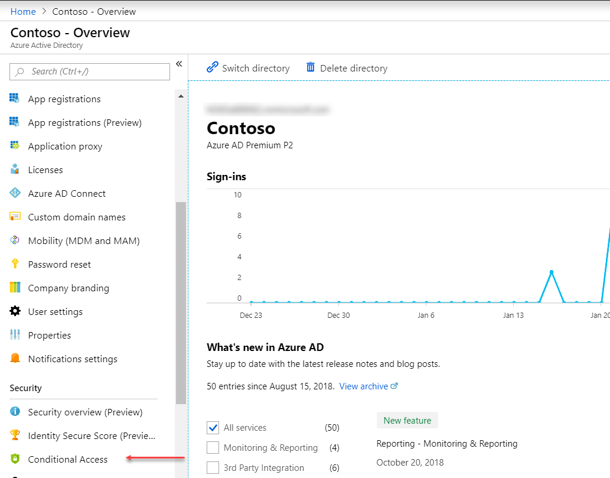

Locate the Policy “Baseline policy: Require MFA for admins”

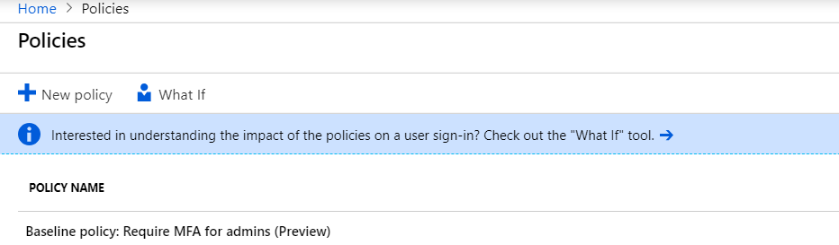

Open the policy

Change the setting to “Enable policy” – click the Exclude user

Add the admin@\<tenantname\> as an excluded user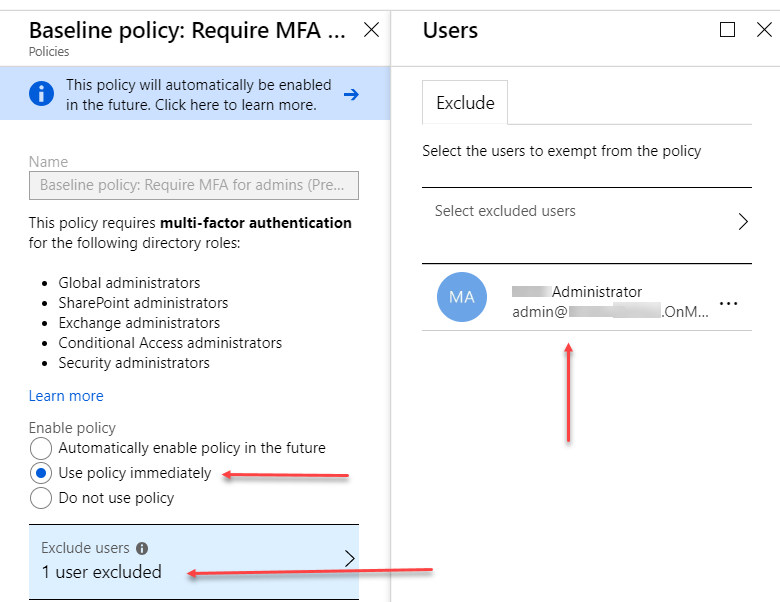

Add a Named Location – New Location

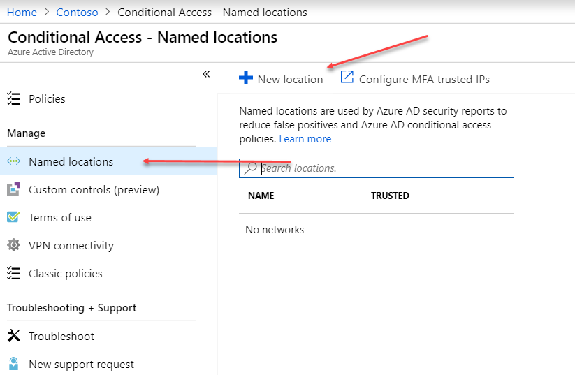

Name: China

Set the “Define the location using” to “Countries/Regions”

In the region specify: “China”

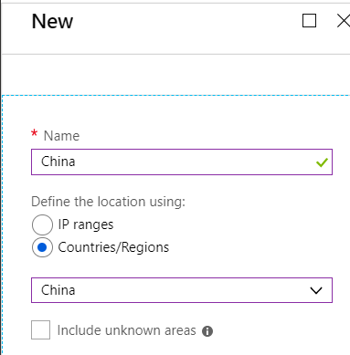

Add New Location

Name: My Home Country

Add your own country to the list

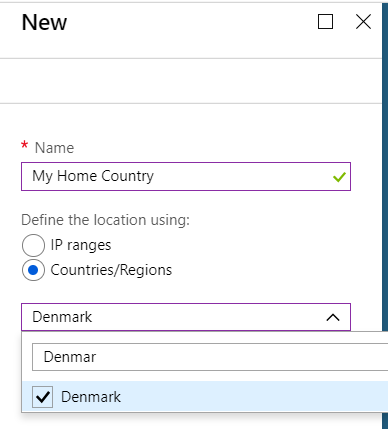

Create a new policy: My Home Country

Change the “Include” to be select users and groups

Put a checkmark in “Users and groups”

Search for Jon Donson and select him  
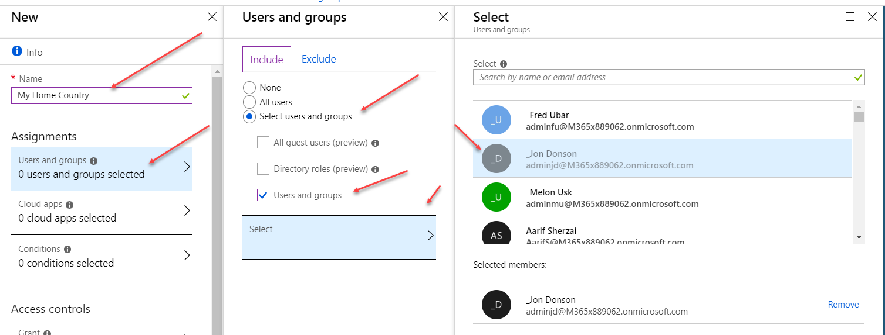

Add a Location  
Configure it – change the scope to Exclude

Selected locations

Select “My Home Country”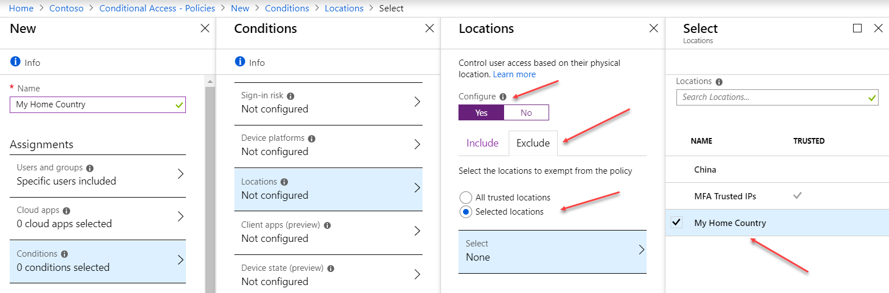

At this stage the Condition Statement is if:

User is Jon Donson and he logs on from anywhere but “My Home Country”

Next step is to determine what should happen if this is true:

We want to enforce everyone that has this Condition Statement to be
granted Access – but require MFA.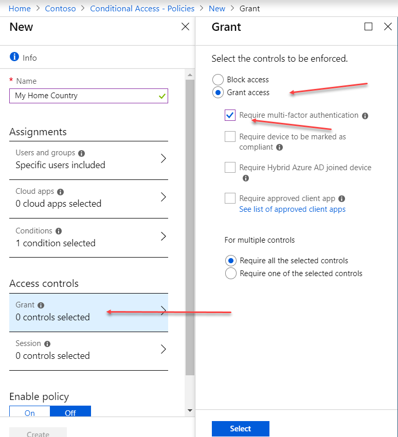

**Create a new Policy – Name it “Don’t go to China” **

Change the “Include” to be select users and groups

Put a checkmark in “Users and groups”

Search for Jon Donson and select him  
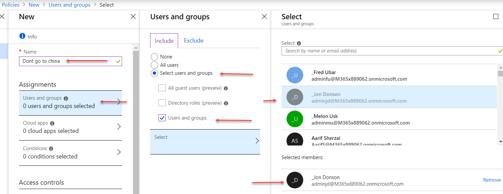

Add a Condition,

Select Location to be Configured

Change the “Include” to be “Selected locations”

Select “China” from the list of locations

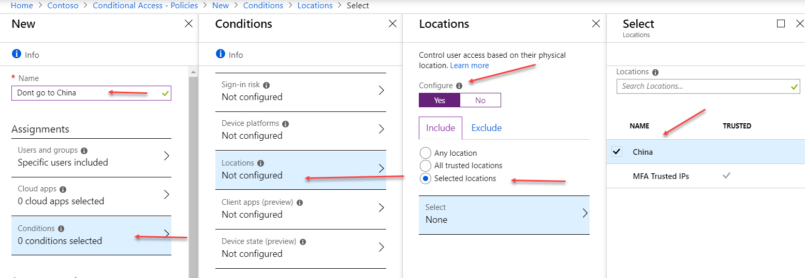

At this stage, you have added a Condition Statement describing

Jon Donson, if based in China

Next step is to determine what should happen if this is true:

Configure Access Control, Grant access – but require multifactor
authentication. 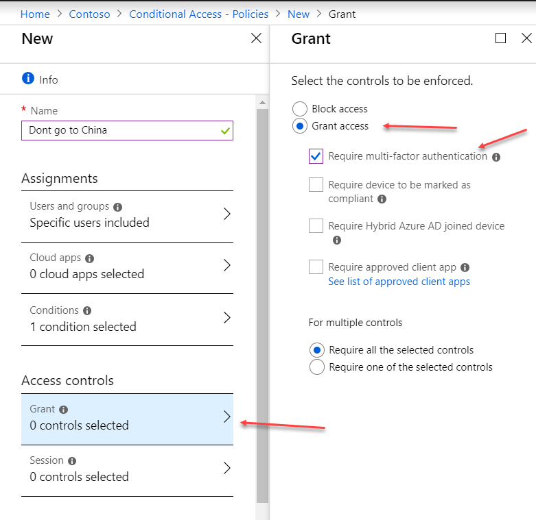

Don’t forget to enable the policy

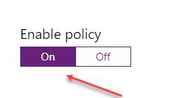

If Jon Donson log on when in China, he will be prompted for MFA.
